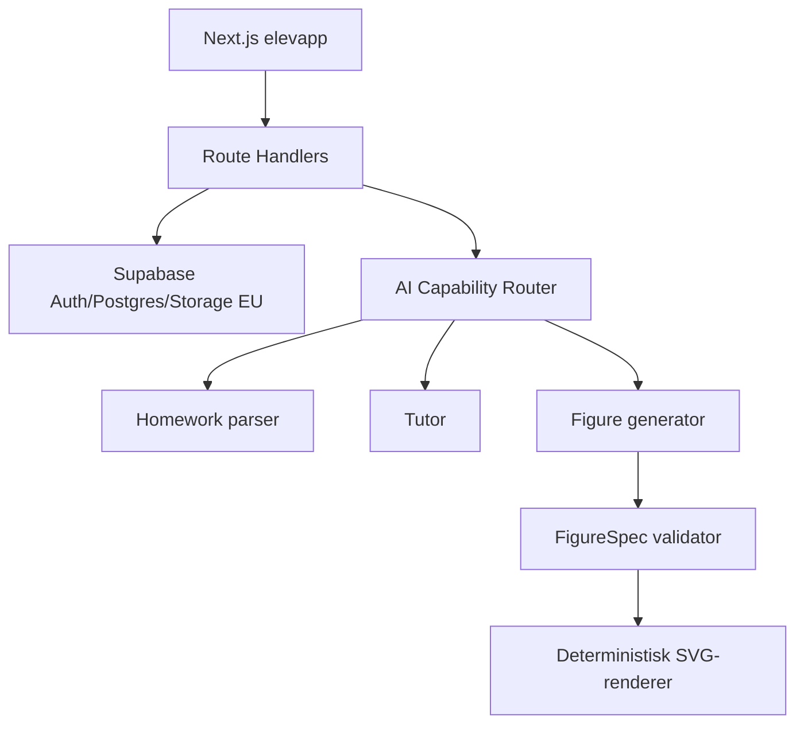
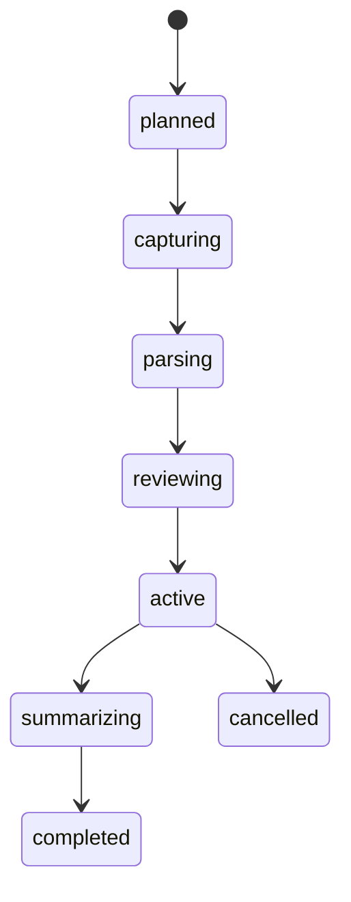

# Mattis PoC – teknisk byggespesifikasjon

Versjon 0.1 · 21. august 2026 · Implementeringsgrunnlag for Luna eller annen kodeagent

> **Hovedmål:** Bygg én fungerende, mobiltilpasset vertikal slice der en elev kan fotografere lekser, kontrollere oppgavene, jobbe med én sammenhengende privatlærerchat og avslutte med en enkel oppsummering og ett lagret læringssignal.

## 1. Slik skal spesifikasjonen brukes

Dette dokumentet er autoritativt for PoC-en. Produktplanen forklarer hvorfor Mattis finnes; denne spesifikasjonen forklarer hva som skal bygges, hvordan delene skal henge sammen og når arbeidet er ferdig.

Implementerende agent skal:

- arbeide milepæl for milepæl, i rekkefølgen i kapittel 22
- holde funksjonalitet utenfor PoC-en avskrudd eller utelatt
- bruke syntetiske elevdata og anonymiserte oppgavebilder
- følge design-tokenene uten å lage et nytt visuelt uttrykk
- validere all modell-output server-side før den lagres eller rendres
- kjøre tester, typecheck og build etter hver milepæl
- stoppe og rapportere dersom personvern, tilgangskontroll eller datatap er uklart

Implementerende agent skal ikke:

- bruke ekte elevdata eller åpne løsningen for offentlig registrering
- gi modeller direkte tilgang til databasen
- legge API-nøkler, Supabase secret key eller service role i klientkode
- lagre rå prompts, modellresponser eller leksebilder i vanlige logger
- generere eller injisere rå SVG/HTML/JavaScript fra en modell
- legge til foreldreportal, betaling, gamification eller full kalender i PoC-en
- endre modellleverandør, tokens eller datalagring uten en eksplisitt beslutning

## 2. PoC-scenario

### 2.1 Syntetisk elev

- Navn i grensesnittet: Nora
- Trinn: 10. trinn
- Språk: norsk bokmål
- Ukesmål: 120 minutter
- Økt: 45 minutter
- Lekser: én side algebra og én geometrioppgave
- Repetisjonsbehov: fortegn i lineære likninger

### 2.2 Ende-til-ende-flyt

1. Nora åpner appen gjennom en lukket demo-innlogging.
2. Hun fullfører en kort onboarding med trinn og ukesmål.
3. Hjemskjermen viser dagens planlagte 45-minuttersøkt.
4. Hun starter økten og legger til ett til tre leksebilder.
5. Mattis analyserer bildene og viser en enkel liste over oppgaver.
6. Nora kan rette tekst, fjerne en oppgave eller legge til et bilde.
7. Økten starter som én chat med oppgaver som kapitler.
8. Mattis veileder gjennom første oppgave uten å gi løsningen for tidlig.
9. En geometrioppgave viser en presis, deterministisk SVG-figur.
10. Når forståelsen er tilstrekkelig, spør Mattis før neste oppgave åpnes.
11. De siste minuttene brukes på ett kort repetisjonsspørsmål.
12. Økten avsluttes med oppsummering, neste tema og ett lagret læringssignal.
13. Ved ny innlasting finnes økten og oppsummeringen fortsatt.

### 2.3 Ferdigkriterium for PoC-en

En testperson skal kunne fullføre hele flyten på mobilbredde uten hjelp. Data skal være isolert per bruker, modell kan byttes gjennom konfigurasjon, leksebildene har slettetid, og ingen sensitive data skal finnes i logger.

## 3. Omfang

### 3.1 Skal bygges

- lukket demo-/OTP-innlogging
- onboarding: visningsnavn, trinn/fag og ukesmål
- enkel hjemskjerm med dagens økt og én startknapp
- flerbilde-opplasting fra kamera eller bildebibliotek
- lokal komprimering, filtype-/størrelseskontroll og privat opplasting
- modellbasert oppgavegjenkjenning med strukturert output
- kontrollskjerm for detekterte oppgaver
- strukturert øktchat med timer og tre faser
- oppgavekapitler med tydelig aktiv/ferdig status
- gradert hinting og kort kontrollspørsmål
- deterministiske geometri-/grafikkfigurer fra FigureSpec JSON
- øktoppsummering og enkelt mestringsanslag
- grunnleggende planlagt neste økt
- eksport/sletting av egen PoC-data gjennom en enkel personvernside
- enhets-, integrasjons- og ende-til-ende-tester for hovedflyten

### 3.2 Skal ikke bygges nå

- offentlig lansering eller ekte elever
- foresattkonto, lærerportal eller klasseadministrasjon
- betaling, abonnement eller prøveperiode
- pushvarsler og avansert gjentakende kalender
- full norsk læreplanmotor eller alle trinn
- generell ChatGPT-lignende samtale utenfor matematikkøkten
- frie KI-genererte produksjonsillustrasjoner
- tale, videosamtale, sosial funksjonalitet eller konkurranser
- automatisk vurdering som brukes til karakterer eller andre viktige beslutninger

## 4. Akseptansekriterier

### 4.1 Brukeropplevelse

- Første primærhandling på hver skjerm er synlig uten scrolling på 390 × 844 px.
- Ingen skjerm viser mer enn én visuelt dominerende knapp.
- Kameraopplasting støtter minst JPEG, PNG og WebP, maksimalt 10 MB per fil.
- Eleven ser antall bilder, opplastingsstatus og hva som eventuelt feilet.
- Oppgavelisten kan redigeres før økten starter.
- Aktiv oppgave og «Oppgave X av Y» er synlig under hele øktfasen.
- Eleven kan alltid stille et fritt matematikkspørsmål i chatfeltet.
- Mattis sender normalt én kort melding eller ett spørsmål om gangen.
- Mattis går ikke automatisk videre uten elevens bekreftelse.
- Timeren tåler refresh og beregnes fra serverlagret starttid, ikke bare klientstate.
- Hele hovedflyten kan brukes med tastatur og skjermleser.

### 4.2 Teknikk og sikkerhet

- `pnpm typecheck`, lint, enhetstester og produksjonsbuild består.
- Alle tabeller i eksponert schema har aktiv RLS og eierskapsbaserte policies.
- En bruker kan ikke lese, oppdatere eller slette en annen brukers data.
- Privat Storage-bucket kan ikke listes offentlig og bruker-ID er første mappenivå.
- AI-kall skjer bare på server i Node-runtime.
- Modell-output avvises dersom den ikke matcher avtalt schema.
- Ingen rå bilder, meldinger eller prompts logges i Vercel-, analyse- eller feilsporingslogger.
- Modellen mottar ikke e-postadresse, skole, klasse eller fullt navn.
- Modellbytte krever bare konfigurasjonsendring og eventuelt provider-adapter, ikke UI-endring.
- Idempotency hindrer doble meldinger og doble parsejobber ved retry.

### 4.3 Personvern

- PoC bruker bare oppdiktede brukere og anonymiserte oppgaver.
- Rå leksebilder får `delete_after` senest 24 timer etter opplasting.
- Full chathistorikk får standard utløp etter 30 dager.
- Innholdsfrie produkt-/driftslogger får standard utløp etter 14 dager.
- Brukeren kan slette økt og tilhørende data.
- Konto-sletting kaskaderer brukerens applikasjonsdata og starter sletting av filer.
- Før ekte pilot er DPIA, behandlingsgrunnlag, foresattflyt, DPA-er og underleverandører godkjent.

## 5. Teknologistack

| Lag | Valg for PoC | Føring |
|---|---|---|
| Monorepo | pnpm workspaces | Ett repo; lås versjoner og commit lockfil |
| Web | Next.js App Router + TypeScript strict | Mobil først; Node-runtime for AI-ruter |
| Styling | CSS-variabler + Tailwind CSS | Tokens er kilden; unngå tilfeldige utility-verdier |
| UI-primitiver | Radix/shadcn ved behov | Brukes for tilgjengelig atferd, ikke som visuelt tema |
| Skjema/validering | Zod eller JSON Schema/Ajv | Samme kontrakter på API-grenser og modell-output |
| Database/Auth/Storage | Supabase i EU-region | `@supabase/ssr`, publishable key i klient, secret bare server |
| KI | Egen provider-adapter | Mistral-først; OpenAI som kvalitetsutfordrer |
| Streaming | Server-Sent Events gjennom Route Handler | Avbryt ved navigasjon; persister ferdig tur |
| Test | Vitest + Testing Library + Playwright | Supabase lokalt for integrasjonstester |
| Hosting | Vercel, EU-region der funksjonen støtter det | Ingen global AI-ruting uten godkjent dataflyt |

Bruk gjeldende stabile versjoner ved oppstart og pin dem i `package.json`/lockfil. Ikke kopier utdaterte eksempler. Next.js bruker `proxy.ts` i nyere versjoner; Supabase SSR skal følge gjeldende dokumentasjon og identitet skal verifiseres server-side med `getClaims()` eller fersk `getUser()`, ikke en ukontrollert cookie-session.

## 6. Foreslått repo-struktur

```text
mattis/
  apps/
    web/
      app/
        (auth)/
        (student)/
        api/
      components/
      lib/
        ai/
        privacy/
        supabase/
      styles/
  packages/
    contracts/       # Zod/JSON Schema, DTO-er og schema-versjoner
    core/            # sesjonsmotor, pedagogiske regler, kostnadslogikk
    figures/         # FigureSpec-validator og deterministisk SVG-renderer
    ui/              # tokens og Mattis-komponenter
  supabase/
    migrations/
    seed.sql
    tests/
  tests/
    e2e/
  docs/
    decisions/
  pnpm-workspace.yaml
  package.json
  .env.example
```

### 6.1 Avhengighetsregel

- `apps/web` kan importere fra alle `packages`.
- `packages/core` kan importere fra `contracts`, men aldri fra Next.js eller Supabase-klienter.
- `packages/figures` mottar kun validert FigureSpec og har ingen provider-avhengighet.
- `packages/ui` inneholder ingen database- eller modellkall.
- Provider-SDK-er finnes bare i `apps/web/lib/ai/providers`.

## 7. Systemarkitektur



### 7.1 Servergrenser

- Server Components leser initial data fra Supabase med brukerens verifiserte identitet.
- Server Actions brukes til små, ikke-streamende mutasjoner som onboarding og plan.
- Route Handlers brukes til opplasting, parsejobber, tutorstream og figurgenerering.
- AI-ruter bruker Node-runtime og har eksplisitt timeout, abortsignal, rate limit og schema-validering.
- Modellen får et minimert kontekstobjekt, aldri fri databasetilgang.
- En providerfeil returnerer en trygg, forståelig feilmelding og beholder elevens arbeid.

### 7.2 Hvorfor ingen AI Gateway som standard

PoC-en kan bruke direkte server-side providerkall for å redusere antall databehandlere. En gateway kan vurderes senere for failover og kostnadskontroll, men først etter DPA, region-, lagrings- og underleverandørgjennomgang. Provider-adapteren gjør dette valget reversibelt.

## 8. Ruter og skjermbilder

| Rute | Skjerm | Viktigste handling |
|---|---|---|
| `/` | Lukket inngang/demo | Fortsett til demo eller logg inn |
| `/onboarding` | Trinn, fag og ukesmål | Lagre og fortsett |
| `/home` | Dagens plan | Start økt |
| `/session/new` | Velg varighet | Fortsett til lekser |
| `/session/[id]/capture` | Legg til leksebilder | Ferdig |
| `/session/[id]/review` | Kontroller oppgaver | Lag økt |
| `/session/[id]` | Strukturert chat | Send svar/spørsmål |
| `/session/[id]/summary` | Oppsummering | Planlegg neste økt |
| `/settings/privacy` | Data og personvern | Eksporter eller slett |

### 8.1 Skjermtilstander som må designes

Hver dataavhengige skjerm skal ha: initial loading, tom, klar, delvis, feil, offline/retry og ferdig. Ikke bruk en generell spinner hvis en enkel skeleton eller statustekst forklarer hva som skjer.

## 9. Designgrunnlag

Den valgte retningen er varm, redaksjonell og tillitvekkende. Appen skal være vennlig og litt leken, men ikke barnslig. Tekst, oppgave og fremdrift kommer før dekorasjon.

### 9.1 Farger

| Rolle | Token | Verdi | Bruk |
|---|---|---|---|
| Primær merkevare | `brand.navy` | `#082F5A` | Overskrifter, ikonlinjer, hovedtekst |
| Korallaksent | `brand.coral` | `#F04E3E` | Dekorasjon og små markører |
| Tilgjengelig primærknapp | `action.primary` | `#D63C31` | Fylte knapper med hvit tekst |
| Turkis | `brand.teal` | `#3E9997` | Fremdrift og sekundære flater |
| Gull | `brand.gold` | `#F2A91D` | Oppsummering og små høydepunkter |
| Bakgrunn | `surface.canvas` | `#FFF9F2` | Appens hovedflate |
| Kantlinje | `border.default` | `#E8DED3` | Rolige skillelinjer |

Korall `#F04E3E` beholdes som visuell merkevarefarge, men brukes ikke automatisk som knappbakgrunn med liten hvit tekst. Den mørkere `action.primary` er kontrollfargen som skal bestå kontrasttest.

### 9.2 Typografi

- Display/overskrifter: Newsreader, selvhostet og lisensiert.
- UI/brødtekst: Inter, selvhostet og lisensiert.
- Matematikk: STIX Two Math eller KaTeX-kompatibel fallback.
- Brødtekst er minimum 16 px i elevflyten.
- Chatmeldinger bruker maksimalt 68–72 tegn per linje på desktop.
- Overskrifter bruker serif; knapper, labels og chat bruker sans serif.

### 9.3 Avstand og rytme

Bruk 4 px grunnrutenett. Tillatte steg: 4, 8, 12, 16, 20, 24, 32, 40, 48, 64 og 80 px. Nye mellomverdier skal ikke introduseres uten at tokenfilen oppdateres.

### 9.4 Hjørner og dybde

| Element | Radius |
|---|---|
| Liten chip/ikonflate | 8 px |
| Knapp | 12 px |
| Input | 14 px |
| Kort/oppgave/chatboble | 16 px |
| Modal/bottom sheet | 24–28 px |
| Statuschip | 999 px |

Bruk skygger sparsomt. De fleste grupper separeres med luft og én svak kantlinje. Ikke legg kort inni kort hvis en enkel seksjonsdeling fungerer.

### 9.5 Ikoner og illustrasjoner

- Bruk én lisensiert ikonfamilie, først Lucide, 1.75 px strek.
- Ingen KI-genererte redaksjonelle illustrasjoner i produksjon.
- Merkevareformer bygges som enkle deterministiske former i kode.
- Fagfigurer genereres fra FigureSpec og rendres deterministisk som SVG.
- Leksebilder brukes aldri som dekorasjon eller treningsdata.

## 10. Komponentspesifikasjon

### 10.1 Knapper

- Primær: 48 px høy, radius 12, mørk korall, hvit tekst, én per skjerm.
- Sekundær: 44–48 px, transparent/krem, 1 px turkis eller marinekant.
- Ghost: kun for lavprioritetshandlinger som «Hopp over».
- Icon button: minimum 44 × 44 px og alltid tilgjengelig navn.
- Loading beholder knappens bredde og forhindrer dobbelttrykk.
- Disabled skal forklare hvorfor hvis årsaken ikke er åpenbar.

### 10.2 Felter

- 48 px høyde, radius 14, 16 px horisontal padding.
- Label over feltet; placeholder er eksempel, ikke label.
- Feilmelding vises under feltet og kobles med `aria-describedby`.
- Matematikkfelt kan åpne spesialtastatur, men vanlig tastatur må fortsatt fungere.

### 10.3 Oppgavekort

- Festes under økthodet på chat-skjermen.
- Viser «Oppgave X av Y», kort oppgavetekst og eventuell figur.
- Kan foldes sammen, men aktiv oppgave kan aldri forsvinne helt.
- Maks én fagfigur og én viktig status i samme kort.

### 10.4 Chat

- Tutor venstre: varm lys flate, marine tekst, maks 82 % bredde.
- Elev høyre: dempet turkis flate, marine tekst, maks 78 % bredde.
- Ikke avatar på hver melding; bruk liten Mattis-markør ved starten av en meldingsgruppe.
- Streaming viser tekst rolig uten overdreven «typing»-animasjon.
- Composer er sticky, tar hensyn til safe-area og har vedlegg, tekstfelt og send.
- «Jeg står fast» ligger som tilgjengelig sekundærhandling, ikke som egen stor boks.

### 10.5 Timer og faser

- Timer vises kompakt som gjenstående tid.
- Faser: Lekser, Repetisjon, Oppsummering.
- Faseindikatoren viser retning, men skal ikke stjele fokus fra chatten.
- Når tiden går ut, avsluttes ikke elevens pågående svar brutalt; Mattis tilbyr oppsummering.

### 10.6 Bildeopplasting

- Støtt `capture="environment"` på mobil og vanlig filvelger som fallback.
- Vis én thumbnail per side, sidetall, status og slett/ta på nytt.
- Komprimer lokalt til fornuftig OCR-kvalitet; bevar lesbar matematikk.
- Fjern EXIF der plattformen tillater det før opplasting.
- Ikke last opp før bruker er autentisert og `session_id` er opprettet.

## 11. Responsivitet, tilgjengelighet og bevegelse

### 11.1 Layout

- Mobil `<768`: full bredde, 16 px gutter, bottom navigation.
- Tablet `768–1023`: 24 px gutter; innhold maks 760–960 px etter skjermtype.
- Desktop `≥1024`: enkel venstrenavigasjon; økt/chat sentreres og er maks 760 px.
- Composer og primærhandlinger respekterer iOS/Android safe-area.

### 11.2 Tilgjengelighet

- Mål WCAG 2.2 AA for hele hovedflyten.
- Minimum 44 × 44 px trykkflate.
- Synlig 3 px fokusindikator med 2 px offset.
- Ikke bruk farge alene for status; kombiner med tekst/ikon.
- SVG-figurer får norsk alt-tekst fra validert FigureSpec.
- Matematiske uttrykk får tilgjengelig MathML/KaTeX-output der mulig.
- Live-region brukes bare for viktige parse-/sendestatusmeldinger.
- Feil flytter ikke fokus uventet; en feilsummering kan få fokus etter submit.

### 11.3 Bevegelse

- Normal overgang 180 ms; korte kontrolltilstander 120 ms; sheet 240 ms.
- Ingen konfetti eller spillaktig feiring i PoC-en.
- `prefers-reduced-motion` fjerner translasjon og ikke-essensielle animasjoner.

## 12. Domene- og datamodell

Den konkrete startmigrasjonen ligger i `mattis-poc-schema.sql`.

| Objekt | Formål | Retensjon |
|---|---|---|
| `profiles` | Trinn, fag, mål og språk | Til konto slettes |
| `sessions` | Øktens plan, fase og oppsummering | Til bruker sletter/konto slettes |
| `homework_uploads` | Filpeker og analyse-status | Råfil normalt maks 24 timer |
| `tasks` | Oppgavetekst, status, konsepter og figur | Til økt/konto slettes |
| `messages` | Elev-/tutormeldinger | Standard 30 dager |
| `learning_evidence` | Små faglige observasjoner | Til konto slettes eller bruker rydder historikk |
| `mastery` | Forklarbart aggregat per emne | Til konto slettes |
| `schedules` | Neste planlagte økt | Til konto slettes |
| `ai_generations` | Modell, latency, tokenbruk, kostnad, status | Ingen prompt/respons; vurder 90 dager |
| `product_events` | Innholdsfrie hendelser | 14 dager |

### 12.1 Datamodellregler

- Alle brukerobjekter har `user_id` eller brukerens auth-ID som primærnøkkel.
- Alle fremmednøkler og RLS-felt indekseres.
- Meldinger bruker `client_message_id` for idempotency.
- `ai_generations` inneholder aldri rå prompt eller rå modellrespons.
- Læringssignal er evidens med score og sikkerhet, ikke en skjult karakter.
- E-post ligger bare i Supabase Auth og sendes aldri til modellene.

## 13. Supabase, Auth og RLS

### 13.1 Prosjekt

- Opprett Supabase-prosjekt i en EU-region.
- Bruk publishable key i klient og secret key kun i sikrede servermiljøer.
- Sett opp `@supabase/ssr` med browser-, server- og proxy-klient.
- Bruk `getClaims()` for normal server-side identitetsverifisering og `getUser()` når fersk brukerpost er nødvendig.
- Ikke stol på `getSession().user` alene for autorisasjon.
- Ingen offentlig signup i PoC; bruk invitasjon, OTP eller demo-seed.

### 13.2 RLS-regler

- RLS er aktivert på alle tabeller i `public`.
- `TO authenticated` kombineres alltid med eierskapspredikat.
- UPDATE har både SELECT-policy, `USING` og `WITH CHECK`.
- `user_metadata` brukes aldri til autorisasjon; bruk `app_metadata` hvis roller senere trengs.
- Views må bruke `security_invoker = true` eller ligge i ueksponert schema.
- `SECURITY DEFINER` brukes ikke som snarvei for policyproblemer.
- Kjør Supabase advisors og negative tilgangstester før hver pilotdeploy.

### 13.3 Storage

- Bucket: `homework-private`, aldri public.
- Objektsti: `<auth.uid()>/<session_id>/<upload_id>.<ext>`.
- Policies for SELECT/INSERT/UPDATE/DELETE validerer første mappe mot `auth.uid()`.
- Signed URLs er korte og opprettes bare server-side ved behov.
- Opplastingsmetadata lagres i `homework_uploads`; råfilens databasepost og Storage-objekt slettes koordinert.

## 14. Personvernarkitektur

### 14.1 Dataflyt for et leksebilde

1. Klienten validerer fil og fjerner metadata der det er praktisk mulig.
2. Filen lastes til privat EU-Storage under brukerens mappe.
3. Serveren henter filen og sender kun bildet + teknisk oppgavekontekst til valgt EU-provider.
4. Strukturert oppgavetekst lagres etter schema-validering.
5. Originalfil markeres for sletting senest 24 timer etter opplasting.
6. Cleanup-jobb sletter objektet og registrerer `deleted_at` uten å logge innholdet.

### 14.2 Dataminimering mot KI

Tillatt kontekst:

- pseudonym intern bruker-ID
- trinn/fag og språk
- aktiv oppgave
- siste få relevante chatmeldinger eller komprimert sammendrag
- utvalgte læringssignaler direkte relevante for oppgaven

Forbudt kontekst:

- e-post, telefon, skole, klasse, adresse eller fullt juridisk navn
- hele elevprofilen eller hele chathistorikken «for sikkerhets skyld»
- andre elevers data
- rå driftslogger

### 14.3 Før ekte pilot

- gjennomfør DPIA/personvernkonsekvensvurdering
- avklar behandlingsgrunnlag og foresatt-/barnflyt med juridisk rådgiver
- signer DPA med Supabase, hosting og alle modellleverandører
- dokumenter region, lagring, underleverandører og eventuelle tredjelandsoverføringer
- aktiver ZDR/store=false der tilgjengelig og nødvendig
- skriv barnevennlig personverntekst og slettestrøm
- gjennomfør sikkerhets- og misbrukstest for mindreårige

## 15. KI-arkitektur

### 15.1 Tre uavhengige capabilities

```ts
type AICapability = 'homework_parser' | 'tutor' | 'figure_generator'

interface AIProviderAdapter<Input, Output> {
  capability: AICapability
  generate(input: Input, context: RequestContext): Promise<Output>
}
```

Hver capability har egen provider, modell-ID, timeout, schema, promptversjon, kostnadsgrense og eval-sett. En provider kan brukes til flere capabilities, men det er aldri en antakelse i domenelogikken.

### 15.2 Startkonfigurasjon

| Capability | Standard PoC | Kvalitetsutfordrer | Kommentar |
|---|---|---|---|
| Homework parser | Mistral OCR 4 / EU | Multimodal kandidat | Lav confidence sendes til elevkontroll, ikke blind retry |
| Tutor | Mistral Small 4 / EU | GPT-5.6 Terra/Sol / EU + ZDR | Produksjonsvalg etter Mattis-evaluering |
| Figure generator | Samme eller separat strukturmodell | Gemini/OpenAI/Mistral kandidat | Output er FigureSpec, aldri ferdig rå SVG |

Modell-ID-er ligger i servermiljøvariabler og må hentes fra aktuell leverandørdokumentasjon når implementasjonen starter.

### 15.3 Ruting

- Standardmodell brukes når input er innenfor capability og kostnadsbudsjett.
- Ett schema-/providerretry er tillatt ved teknisk feil.
- Lav faglig sikkerhet gir `needs_human_review` eller elevkontroll, ikke endeløs modellkjede.
- Premium-eskalering kan brukes for et vanskelig kontrollpunkt etter feature flag.
- Hver generering registrerer metadata i `ai_generations` uten innhold.

## 16. Homework parser-kontrakt

Kanonisk schema finnes i `mattis-ai-contracts.schema.json` som `HomeworkParseResponse`.

Parseren skal:

- bevare oppgavenummer og matematisk notasjon
- dele sider i separate oppgaver
- normalisere tekst uten å endre matematisk mening
- angi oppgavetype, relevante concept keys og confidence
- sette `needsReview=true` ved lav sikkerhet, avkuttet tekst eller tvetydig figur
- returnere en FigureSpec bare når figuren kan beskrives presist
- aldri løse oppgaven i den elevvendte parsefasen

Serveren skal avvise:

- ukjente properties
- mer enn 20 sider eller 100 oppgaver
- tom oppgavetekst
- confidence utenfor 0–1
- rå SVG/HTML/JavaScript
- prompt-injection-tekst som forsøker å endre systematferd

## 17. Tutor-kontrakt og pedagogikk

Kanonisk schema finnes som `TutorTurnResponse`.

### 17.1 Pedagogisk løkke

1. **Orienter:** avklar hva oppgaven spør om og hva eleven har prøvd.
2. **Aktiver:** be om ett lite faglig steg.
3. **Evaluer:** vurder svaret matematisk og pedagogisk.
4. **Hint:** gi minst mulig støtte som bringer eleven videre.
5. **Kontroller:** be om forklaring eller et nært kontrollspørsmål.
6. **Oppsummer:** formuler ett kort læringspunkt.
7. **Bekreft:** spør om eleven er klar før neste oppgave.

### 17.2 Hintnivå

| Nivå | Støtte |
|---|---|
| 0 | Åpent aktiveringsspørsmål |
| 1 | Pek på relevant idé eller regel |
| 2 | Del opp i første konkrete delsteg |
| 3 | Vis et parallelt eksempel med andre tall |
| 4 | Vis nesten hele framgangsmåten, men la eleven fullføre siste faglige steg |

Mattis kan gi et fullstendig svar når eleven eksplisitt ber om fasit etter reell veiledning, når økten avsluttes og oppgaven må oppsummeres, eller når sikkerhet/tilgjengelighet tilsier det. Den skal da forklare framgangsmåten, ikke bare svaret.

### 17.3 Modellkontekst per tur

- systemregler og promptversjon
- språk, trinn og relevant læreplankontekst
- aktiv oppgave og validert figur
- oppgavens status og brukt hintnivå
- maks siste seks relevante meldinger eller kort sammendrag
- høyst tre relevante læringssignaler
- gjenstående tid og aktiv fase

### 17.4 Oppgave ferdig

Modellen kan foreslå `ready_to_complete`, men serverens sesjonsmotor bestemmer status. Før `completed` kreves riktig svar/metode, minst ett tegn på forståelse og elevens bekreftelse eller en eksplisitt sluttregel.

## 18. Figurgenerering

### 18.1 Prinsipp

Figurmodellen lager semantisk FigureSpec JSON. En egen validator og renderer lager SVG. Dette gir presisjon, testbarhet, tilgjengelighet og leverandørbytte.

Tillatte figurtyper i PoC:

- geometri: punkt, linje, polygon, sirkel, rett vinkel og labels
- koordinatsystem: akser, ticks, punkt og funksjonsplot
- tallinje
- enkel bar model
- enkel tabell

### 18.2 Sikkerhet og presisjon

- Ingen `dangerouslySetInnerHTML`.
- Ingen modellskrevet rå SVG eller CSS.
- Alle tall må være finite og innenfor viewport.
- Funksjonsuttrykk parses med en allowlist; aldri `eval`.
- Labels har lengdegrense og escapes.
- Renderer får snapshot-/geometritester med kjente fasiter.
- Figuren får alt-tekst og kan skaleres uten tap.

### 18.3 Fremtidig illustrasjonsmodell

En eventuell modell for rikere oppgaveillustrasjoner skal ligge bak en fjerde, separat capability og en menneskelig asset-review. Den skal ikke blandes med fagfigur-rendereren og er avslått i PoC/produksjon til lisens, stilkontroll og personvern er avklart.

## 19. API-kontrakter

| Metode og rute | Input | Output | Viktige krav |
|---|---|---|---|
| `POST /api/homework/parse` | session ID + upload IDs | parsejobb eller validert tasks | Eierskap, idempotency, maks 20 sider |
| `GET /api/homework/parse/[jobId]` | jobb-ID | status + reviewresultat | Kun eier; ingen providerpayload |
| `POST /api/tutor/respond` | session ID, task ID, message, client ID | SSE + final TutorTurnResponse | Rate limit, abort, lagre ferdig tur atomisk |
| `POST /api/figures/generate` | task ID + figurbehov | validert FigureSpec | Kun internt fra sesjonsflyt i PoC |
| `POST /api/sessions/[id]/complete-task` | task ID + bekreftelse | neste status | Servereiet state transition |
| `POST /api/sessions/[id]/complete` | sluttdata | oppsummering + neste fokus | Idempotent |
| `DELETE /api/sessions/[id]` | session ID | 204 | Slett DB-data og tilhørende filer |

Alle POST-ruter bruker CSRF-sikre same-site cookies, verifisert auth, body-size-grense, Zod/Ajv, generert request ID og stabil feilkontrakt. Feilkontrakten inneholder kode, elevvennlig melding og `retryable`, men aldri providerfeil eller stacktrace.

## 20. Sesjonsmotor



### 20.1 Faser

- Lekser: standard 30 minutter av en 45-minuttersøkt.
- Repetisjon: standard 10 minutter, basert på relevant læringssignal.
- Oppsummering: standard 5 minutter.

Sesjonsmotoren bruker faktiske timestamps. Den kan foreslå fasebytte, men utsetter det hvis eleven er midt i et svar. State transitions valideres i `packages/core`, ikke i UI eller modellprompt.

### 20.2 Task-state

`detected → confirmed → in_progress → checking → completed`, med `skipped` som eksplisitt sidegren. Bare én task er aktiv per økt i PoC-en.

## 21. Logging, måling og kostnad

### 21.1 Tillatt metadata

- route/capability og teknisk status
- tilfeldig request/generation ID
- provider og modell
- latency, token-/sideforbruk og estimert kostnad
- schema-versjon og valideringsresultat
- overordnet safety flag uten elevtekst

### 21.2 Forbudt i logger

- leksebilder eller signerte URL-er
- navn, e-post og andre identifikatorer
- chatinnhold, oppgavetekst eller modellprompt
- rå modellrespons
- Supabase-/provider-nøkler

### 21.3 PoC-mål

- parse success etter elevkontroll: ≥95 % av testsettet
- matematisk korrekt tutorrespons: ≥98 % på avgrenset eval-sett
- median første stream-token: mål <2,5 s
- parse av to sider: mål <12 s
- full økt uten teknisk stopp: ≥90 % i intern test
- modellkostnad registrert for 100 % av genereringene

Tallene er arbeidsmål, ikke markedsføringspåstander.

## 22. Implementeringsmilepæler for Luna

### M0 – Repo og kvalitetsporter

Leveranse:

- pnpm workspace og Next.js App Router
- TypeScript strict, lint, formatter, Vitest og Playwright
- `.env.example`, secrets-policy og CI for typecheck/test/build
- dokumentert lokal oppstart

Ferdig når CI består på tom app, lockfil er committed og ingen secrets finnes i repo.

### M1 – Designsystem og statisk hovedflyt

Leveranse:

- design-tokens som CSS-variabler/Tailwind theme
- typografi, knapper, input, kort, chatbobler, phase rail og app shell
- statiske skjermbilder for onboarding, hjem, capture, review, session og summary
- responsivitet og tastaturnavigasjon

Ferdig når skjermene matcher referanser og tokenverdier, uten backend eller ekte modellkall.

### M2 – Supabase-grunnlag

Leveranse:

- lokal Supabase, første migrasjon og seeddata
- SSR-klienter og `proxy.ts`
- lukket demo-/OTP-auth
- RLS- og Storage-policies
- negative integrasjonstester mellom to brukere

Ferdig når bruker A aldri kan lese eller mutere bruker B sine rader eller filer.

### M3 – Lekseinntak med mock parser

Leveranse:

- bildevelger/kamera, komprimering og privat opplasting
- opprettelse av session og upload records
- mock HomeworkParseResponse
- kontrollskjerm med redigering, sletting og retry

Ferdig når 1–3 bilder gir en redigerbar oppgaveliste og refresh ikke mister state.

### M4 – Ekte homework parser

Leveranse:

- provider-adapter og Mistral OCR-provider
- schema-validering, timeout, ett retry og genereringsmetadata
- usikkerhet/warnings og elevkontroll
- automatiske testsamples uten persondata

Ferdig når eval-settet kjøres repeterbart og feil providerpayload aldri når databasen.

### M5 – Sesjonsmotor og mock tutor

Leveranse:

- state machine, timer og oppgavekapitler
- chatcomposer, streamingmock og task completion
- reload/reconnect og idempotente meldinger
- repetisjons- og oppsummeringsfase

Ferdig når en hel 45-minuttersflyt kan simuleres raskt i testmodus.

### M6 – Ekte tutor og modellbytte

Leveranse:

- tutor-adapter, minimert kontekst og strukturert output
- server-side streaming og atomisk lagring av ferdig tur
- hintregler, sikkerhetsflagg og confidence-escalation
- feature flag for kandidatmodell og sammenlignbar eval

Ferdig når standardmodell kan byttes uten UI-/datamodellendring, og tutor-eval består terskelen.

### M7 – FigureSpec og geometri

Leveranse:

- JSON-validator, renderer og tilgjengelig SVG
- minst geometri, koordinatsystem og tallinje
- snapshot-/geometritester
- figure generator-adapter bak feature flag

Ferdig når trekant-eksemplet rendres matematisk korrekt på mobil og desktop uten rå SVG fra modellen.

### M8 – Oppsummering, elevminne og personvern

Leveranse:

- learning evidence og forklarbart mastery-aggregat
- oppsummeringsside og neste fokus
- eksport/sletting av egen data
- cleanup for bilder, meldinger og events
- innholdsfrie logger og kostnadsoversikt

Ferdig når slettetest, TTL-test og hele e2e-flyten består.

### M9 – Handoffklar PoC

Leveranse:

- komplett eval-rapport for parser/tutor/figurer
- accessibility-pass, mobil nettlesertest og feiltilstandstest
- oppdatert beslutningslogg, runbook og kjente begrensninger
- lukket stagingdeploy med syntetiske data

Ferdig når PoC-en kan demonstreres uten utviklerverktøy og uten ekte elevdata.

## 23. Teststrategi

### 23.1 Enhet

- session- og task-transitions
- tidsfordeling og gjenstående tid
- modellruting og kostnadsberegning
- schema-validering og ukjente properties
- FigureSpec bounds, escaping og uttrykksallowlist
- mastery-oppdatering fra evidens

### 23.2 Integrasjon

- Supabase auth/proxy og serveridentitet
- RLS med bruker A/B for alle bruker-tabeller
- Storage policies og object paths
- parse idempotency og providerfeil
- ferdig tutorstream lagres én gang
- sletting fjerner databaseposter og Storage-objekter

### 23.3 E2E

1. Logg inn som demo-Nora.
2. Fullfør onboarding.
3. Start økt fra hjem.
4. Last opp to fixtures.
5. Kontroller seks detekterte oppgaver.
6. Fullfør én algebraoppgave gjennom chat.
7. Vis og bruk en geometri-SVG.
8. Avslutt økten og se oppsummering.
9. Refresh og bekreft persistert state.
10. Slett økten og bekreft at data ikke lenger kan leses.

### 23.4 Modell-evaluering

Opprett versjonert, personfritt eval-sett med 50–100 norske oppgaver. Score kandidatene på OCR, matematisk korrekthet, hintkvalitet, norsk, svarlekkasje, sikkerhet, latency og kostnad. Eval-resultater skal være sammenlignbare på capability og promptversjon.

## 24. Miljøvariabler

```dotenv
# Public browser-safe
NEXT_PUBLIC_SUPABASE_URL=
NEXT_PUBLIC_SUPABASE_PUBLISHABLE_KEY=
NEXT_PUBLIC_APP_ENV=local

# Server only
SUPABASE_SECRET_KEY=
AI_HOMEWORK_PROVIDER=mistral
AI_HOMEWORK_MODEL=
AI_TUTOR_PROVIDER=mistral
AI_TUTOR_MODEL=
AI_TUTOR_CHALLENGER_PROVIDER=openai
AI_TUTOR_CHALLENGER_MODEL=
AI_FIGURE_PROVIDER=mistral
AI_FIGURE_MODEL=
MISTRAL_API_KEY=
OPENAI_API_KEY=
AI_REGION=eu
AI_STORE_CONTENT=false
AI_MAX_SESSION_COST_USD=0.50
HOMEWORK_RETENTION_HOURS=24
MESSAGE_RETENTION_DAYS=30
EVENT_RETENTION_DAYS=14
DEMO_MODE=true
```

Kun variabler med `NEXT_PUBLIC_` kan nå browseren. `.env.local` committes aldri. Staging og produksjon bruker separate Supabase-prosjekter og provider-nøkler.

## 25. Agentprotokoll

Luna skal få følgende instruksjon sammen med repoet:

> Les produktplanen, denne byggespesifikasjonen, design-tokenene, AI-kontraktene og SQL-baselinen. Implementer bare neste uferdige milepæl. Før du endrer kode, oppsummer hvilke filer og tester milepælen krever. Ikke endre produktomfang, datalagring, design-tokens eller providerstrategi uten eksplisitt beslutning. Bruk syntetiske data. Etter endringen: kjør typecheck, lint, tester og build; rapporter resultater, personvernkonsekvens, kjente avvik og neste anbefalte milepæl. Stopp ved uklar tilgangskontroll, risiko for datatap, behov for ekte elevdata eller behov for nye tredjeparts databehandlere.

Arbeidet bør gjennomgås av en sterkere modell eller menneske etter M2, M4, M6 og M8, fordi disse milepælene påvirker henholdsvis tilgangskontroll, bildedata, pedagogisk sikkerhet og personvern.

## 26. Åpne beslutninger som ikke blokkerer M0–M3

- Om produksjonstutor blir Mistral, OpenAI eller en rutet kombinasjon.
- Nøyaktig første pilotgruppe og behandlingsgrunnlag.
- Om foresatt eier kontoen eller barnet får separat tilgangskode.
- Hvor lenge ferdige oppgavetekster og mastery skal beholdes i produksjon.
- Om appen skal være PWA først eller gå til Expo før pilot.
- Hvilken læreplanversjon og fagkode som blir første autoritative datasett.

Disse beslutningene må låses før en pilot med ekte mindreårige, men de skal ikke føre til unødvendig abstraksjon i PoC-en.

## 27. Definition of Done

PoC-en er handoffklar når:

- alle akseptansekriterier i kapittel 4 er dokumentert og testet
- hovedflyten består på mobil og desktop
- RLS- og Storage-negative tester består
- parser, tutor og figurer kan bytte modell uavhengig
- ingen modell-output rendres eller lagres uten validering
- eval-settet og kostnadsmetadata fungerer
- rå bilder, meldinger og events følger avtalte TTL-er
- ingen ekte elevdata eller produksjonsnøkler finnes i testmiljøet
- kjente begrensninger og åpne beslutninger er oppdatert
- en annen utvikler/agent kan starte appen fra README uten muntlig kontekst

## 28. Autoritative støttefiler

- `mattis-design-tokens.json` – eksakte UI-tokens og asset-policy
- `mattis-ai-contracts.schema.json` – provider-nøytrale modellkontrakter
- `mattis-poc-schema.sql` – første Supabase-schema, RLS og privat Storage
- Produktplan v0.2 – produktvalg, flyter og visuelle referanser

## 29. Kilder som skal kontrolleres ved implementasjon

- Next.js App Router: https://nextjs.org/docs/app
- Supabase Next.js/SSR: https://supabase.com/docs/guides/auth/server-side/creating-a-client
- Supabase RLS: https://supabase.com/docs/guides/database/postgres/row-level-security
- Supabase Storage access control: https://supabase.com/docs/guides/storage/security/access-control
- Supabase product security: https://supabase.com/docs/guides/security/product-security
- Mistral regional inference: https://docs.mistral.ai/inference/regional-inference
- Mistral pricing: https://docs.mistral.ai/inference/pricing
- OpenAI API data controls: https://developers.openai.com/api/docs/guides/your-data
- OpenAI guidance for minors: https://developers.openai.com/api/docs/guides/safety-checks/under-18-api-guidance
- EDPB DPIA guidance: https://www.edpb.europa.eu/sme/be-compliant/be-compliant_en

Dette er en teknisk og produktmessig baseline, ikke juridisk rådgivning. Retensjon, behandlingsgrunnlag og foresattflyt skal valideres juridisk før ekte pilot.
